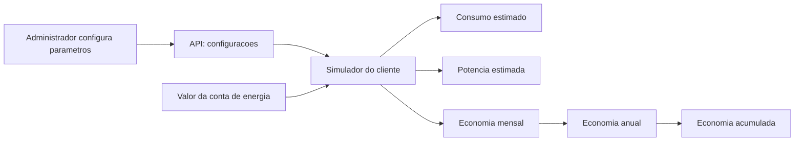

# Configuracoes do simulador

Este documento mostra como os valores definidos no painel administrativo sao aplicados na simulacao exibida ao cliente.

## Formulas aplicadas

| Resultado exibido | Formula | Configuracoes usadas |
| --- | --- | --- |
| Consumo estimado | `valor da conta / tarifa media` | Tarifa media de energia |
| Potencia estimada | `consumo / ((producao media / 12) * fator de perdas)` | Producao media por kWp e fator de perdas |
| Economia mensal | `valor da conta * percentual de economia` | Percentual de economia estimada |
| Economia anual | `economia mensal * 12` | Percentual de economia estimada |
| Economia acumulada | `economia anual * vida util` | Vida util |

## Exemplo

Para uma conta mensal de R$ 520,00 e os valores padrao:

| Configuracao | Valor |
| --- | ---: |
| Tarifa media de energia | R$ 1,70 |
| Producao media por kWp | 1.400 kWh/ano |
| Fator de perdas | 0,90 |
| Percentual de economia estimada | 35% |
| Vida util | 25 anos |

O simulador calcula:

- Consumo estimado: `520 / 1,70 = 306 kWh`
- Potencia estimada: `306 / ((1.400 / 12) * 0,90) = 2,91 kWp`
- Economia mensal: `520 * 0,35 = R$ 182,00`
- Economia anual: `182 * 12 = R$ 2.184,00`
- Economia acumulada: `2.184 * 25 = R$ 54.600,00`

## Custo estimado por kWp

Esse parametro esta disponivel para configuracao, mas nao e exibido no resultado atual. Ele pode ser utilizado futuramente para calcular o investimento estimado do projeto e o prazo de retorno.
